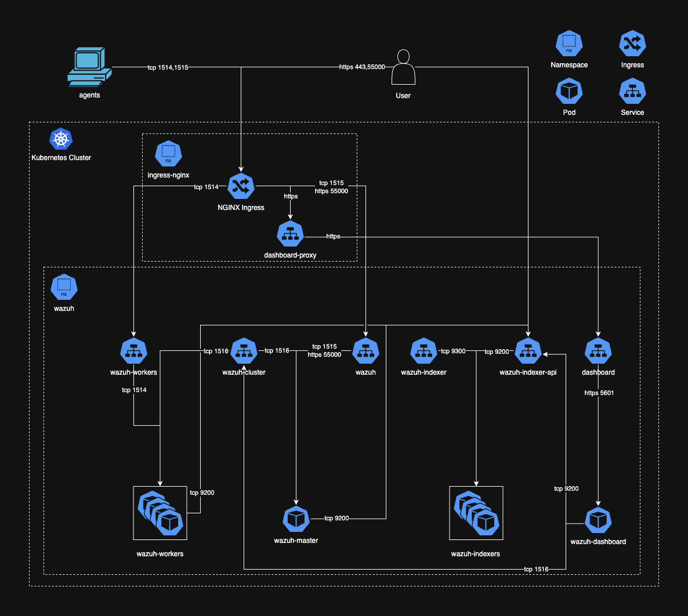
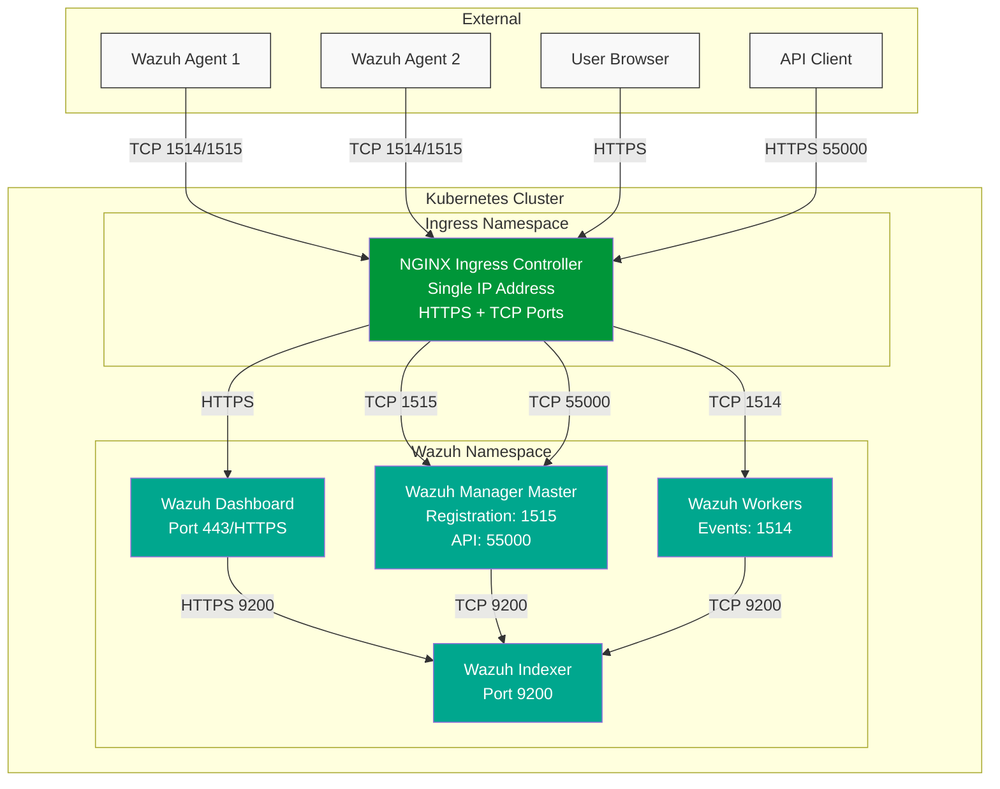

# Wazuh Kubernetes Deployment

A comprehensive solution for deploying Wazuh on Kubernetes with Terraform automation.

## Architecture



### NGINX Ingress Architecture for Wazuh


### Single Endpoint Architecture
 
One of the key improvements in this deployment is using an NGINX ingress controller to provide a **single IP address for all Wazuh services**:

- **Dashboard access**: HTTPS on the same IP
- **Agent registration**: TCP port 1515 forwarded through ingress
- **Agent event collection**: TCP port 1514 forwarded through ingress
- **API access**: Port 55000 forwarded through ingress

This differs from the default Wazuh Kubernetes deployment, which creates separate LoadBalancer services with different IP addresses for each component. Our approach significantly simplifies management and reduces costs by requiring only one load balancer.

This architecture consists of:
- Wazuh Manager (Master and Worker nodes) for log collection and analysis
- Wazuh Indexer for storage and search
- Wazuh Dashboard for visualization
- Kubernetes running on Linode Kubernetes Engine (LKE)
- Agent deployment automation for Linux, MacOS, and Windows


## Prerequisites

### Required Tools

| Tool | Minimum Version | Installation Guide |
|------|-----------------|-------------------|
| Terraform | v1.0.0+ | [Installation Guide](https://developer.hashicorp.com/terraform/install) |
| kubectl | v1.20.0+ | [Installation Guide](https://kubernetes.io/docs/tasks/tools/) |
| Kustomize | v4.0.0+ | [Installation Guide](#kustomize) |
| Helm | v3.8.0+ | [Installation Guide](#helm) |

### Linode Requirements
- A Linode account
- Linode API token with read/write access

### Kustomize

```shell
curl -s "https://raw.githubusercontent.com/kubernetes-sigs/kustomize/master/hack/install_kustomize.sh" | bash
sudo mv kustomize /usr/local/bin/kustomize
```

### Helm

```shell
curl -LO https://get.helm.sh/helm-v3.17.2-linux-amd64.tar.gz
tar -zxvf helm-v3.17.2-linux-amd64.tar.gz
sudo mv linux-amd64/helm /usr/local/bin/helm
helm --help
```

## Repository Setup

This repository uses Wazuh K8s version v4.11.1. If you need to update the base configurations, follow these steps:

```shell
export GIT_TAG=v4.11.1
cd /tmp
git clone https://github.com/wazuh/wazuh-kubernetes --branch $GIT_TAG
cp -r /tmp/wazuh-kubernetes/wazuh/* ./kubernetes/wazuh/base
```

## Deployment

### 1. LKE K8s Cluster Setup

```shell
cd terraform/lke-cluster
export TF_VAR_token=your_linode_api_token
terraform init
terraform plan -var-file="terraform.tfvars"
terraform apply -var-file="terraform.tfvars"
```

#### Connect to LKE

```shell
export KUBE_VAR=`terraform output kubeconfig` && echo $KUBE_VAR | base64 -di > lke-cluster-config.yaml
export KUBECONFIG=$(realpath lke-cluster-config.yaml)
```

Verify connectivity:
```shell
kubectl get nodes
```

### 2. Generate Certificates

Generate certificates for indexer and dashboard:
```shell
./kubernetes/wazuh/base/certs/dashboard_http/generate_certs.sh
./kubernetes/wazuh/base/certs/indexer_cluster/generate_certs.sh
```

### 3. Deploy Wazuh

```shell
kustomize build ./kubernetes/wazuh/lke/ --enable-helm | kubectl apply -f -
```

Wait for all pods to be running:
```shell
kubectl -n wazuh get pods --watch
```

## Access the Deployment

### Wazuh Dashboard

Get Dashboard URL:
```shell
export WAZUH_DASHBOARD_IP=$(kubectl -n ingress-nginx get svc ingress-nginx-controller -o json | jq -r '.status.loadBalancer.ingress[].ip')
echo "https://$WAZUH_DASHBOARD_IP"
```

Get credentials:
```shell
# Username
kubectl -n wazuh get secret dashboard-cred -o json | jq -r '.data.username' | base64 -d
# Password
kubectl -n wazuh get secret dashboard-cred -o json | jq -r '.data.password' | base64 -d
```

### Wazuh Manager Info (For Agent Connection)

```shell
# Manager IP
export WAZUH_MANAGER=$(kubectl -n ingress-nginx get svc ingress-nginx-controller -o json | jq -r '.status.loadBalancer.ingress[].ip')
# Registration Password
export WAZUH_REGISTRATION_PASSWORD=$(kubectl -n wazuh get secret wazuh-authd-pass -o json | jq -r '.data."authd.pass"' | base64 -d)
```

## Agent Deployment

### Linux Agents

```shell
cd agents/linux-amd64
sudo WAZUH_MANAGER=x.x.x.x WAZUH_REGISTRATION_PASSWORD=xxx WAZUH_AGENT_NAME=hostname ./enroll-linux.sh
```

### MacOS Agents

```shell
cd agents/macos-arm
curl -LO https://packages.wazuh.com/4.x/macos/wazuh-agent-4.11.1-1.arm64.pkg
sudo ./enroll-mac.sh <WAZUH_MANAGER> <WAZUH_REGISTRATION_SERVER> <WAZUH_REGISTRATION_PASSWORD> wazuh-agent-4.11.1-1.arm64.pkg
```

### Windows Agents

```powershell
cd agents/windows-amd64
# Run as Administrator
.\Install-WazuhAgent.ps1 -WazuhManager <WAZUH_MANAGER> -RegistrationServer <WAZUH_REGISTRATION_SERVER> -RegistrationPassword <WAZUH_REGISTRATION_PASSWORD> -AgentName <WAZUH_AGENT_NAME>
```

### Automated Agent Deployment (Linode VMs)

```shell
cd terraform/linode_instances
export TF_VAR_token=your_linode_api_token
export TF_VAR_wazuh_manager=$WAZUH_MANAGER
export TF_VAR_wazuh_registration_password=$WAZUH_REGISTRATION_PASSWORD
terraform init
terraform plan -var-file="terraform.tfvars"
terraform apply -var-file="terraform.tfvars"
```

## Agent Management

### Deregistering Agents

```shell
AGENTS=001,002,003
export WAZUH_API_IP=$(kubectl -n ingress-nginx get svc ingress-nginx-controller -o json | jq -r '.status.loadBalancer.ingress[].ip')
export WAZUH_API_USERNAME=$(kubectl -n wazuh get secret wazuh-api-cred -o json | jq -r '.data.username' | base64 -d)
export WAZUH_API_PASSWORD=$(kubectl -n wazuh get secret wazuh-api-cred -o json | jq -r '.data.password' | base64 -d)

TOKEN=$(curl -u "$WAZUH_API_USERNAME:$WAZUH_API_PASSWORD" -k -X GET "https://$WAZUH_API_IP:55000/security/user/authenticate?raw=true")
curl -k -X DELETE "https://$WAZUH_API_IP:55000/agents?pretty=true&older_than=0s&agents_list=$AGENTS$&status=all" -H "Authorization: Bearer $TOKEN"
```

## Uninstallation

### Uninstall Agents

#### Linux
```shell
sudo apt-get remove --purge wazuh-agent
sudo systemctl disable wazuh-agent
sudo systemctl daemon-reload
```

#### MacOS
```shell
sudo ./agents/macos-arm/uninstall-wazuh.sh
```

#### Windows
```powershell
# Run as Administrator
msiexec.exe /x wazuh-agent-4.11.1-1.msi /qn
```

### Delete Kubernetes Resources

```shell
kustomize build ./kubernetes/wazuh/lke/ --enable-helm | kubectl delete -f -
```

### Destroy LKE Cluster

```shell
cd terraform/lke-cluster
terraform destroy -var-file="terraform.tfvars"
```

## Troubleshooting

### Common Issues

#### Certificates
- If you're seeing certificate errors in the dashboard, regenerate certificates and restart the pods:
  ```bash
  kubectl -n wazuh delete pod -l app=wazuh-dashboard
  ```

#### Agent Connectivity
- If agents cannot connect, ensure firewall rules allow traffic to ports 1515 and 1514
- Verify the registration password is correct

#### Pods Stuck in Pending
- Check storage class: `kubectl get sc`
- Verify PVC creation: `kubectl -n wazuh get pvc`